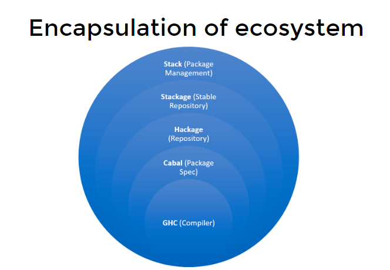

# Lecture 1. Stack. How to build/run/test

Содержание:
- GHC, GHCi
- Haskell project structure
- Stack. Features
- How stack works. Snapshots
- .cabal and .yaml files
- Basic comands

Presentation: https://slides.com/fp-ctd/lecture-1#/

## GHC, GHCi

GHC - компилятор языка Haskell. GHCi - интерпретатор языка Haskell.

## Haskell project structure

```
.
├── app
│   └── Main.hs
├── src
│   └── Lib.hs
├── test
│   └── Spec.hs
├── .gitignore
├── LICENSE
├── README.md
├── Setup.hs
├── stack.yaml
└── package.yaml
```

Описание: 
    
      * `app` - исполняемый файл
      * `src` - исходный код библиотеки
      * `test` - тесты
      * `stack.yaml` - конфигурация для `stack`
      * `package.yaml` - конфигурация для `cabal`

## Stack. Features

Stack - кроссплатформенный менеджер зависимостей для Haskell. Основные возможности:

    * Создание изолированных окружений для проектов
    * Установка и управление версиями библиотек
    * Сборка проектов, тестирование, запуск


## How stack works. Snapshots

  Stack использует snapshots. Snapshot - это набор библиотек, которые были собраны вместе. Существует несколько типов snapshots:

  * `lts` - Long Term Support. Стабильные версии библиотек. Рекомендуется для продакшена.

  * `nightly` - Ночные сборки. Не стабильные версии библиотек. Рекомендуется для разработки.

  * `custom` - Собственный snapshot. Можно создать свой snapshot, указав список библиотек.


## .cabal and .yaml files

* `.cabal` - конфигурация для `cabal`

* `.yaml` - конфигурация для `stack`

  

## Basic comands

`stack new new-project` - создать новый проект

`stack build` - собрать проект

`stack test` - запустить тесты

`stack build --test` - собрать проект и запустить тесты

`stack build --fast` - собрать проект без оптимизации. За счет этого сборка происходит быстрее.

`stack exec new-project-exe` - запустить исполняемый файл

`stack clean` - удалить собранные файлы


