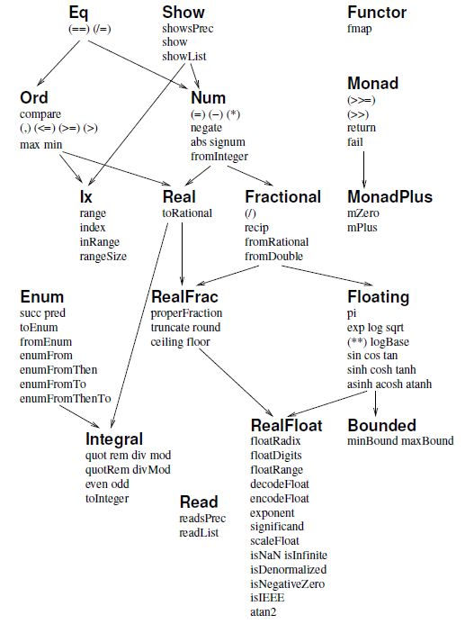

# Lecture 1. Stack. How to build/run/test

Содержание:
- Introduction to Haskell
    - Basic GHCi examples
    - Function & operators definition
    - Lists and functions on lists
- Haskell syntax
    - let (variable declaration)
    - where clause
    - if expression
    - Guards
    - case expression
    - Higher order functions
    - Lambdas (anonymous functions)
- Polymoprhism
    - Parametric
    - Ad-hoc
- LANGUAGE pragmas
    - -XTupleSections
    - -XLambdaCase
    - -XViewPatterns
- Currying (aka partial application)
- Pattern matching
- List comprehension
- Function application: ($)
- Function composition: (.)
- Lazy evaluation (erathosphene sieve, fibonacci numbers, repmin)

Presentation: http://slides.com/fp-ctd/lecture-2#/

## Introduction to Haskell

### Haskell features

- Static types - типы выражений проверяются на этапе компиляции
- Immutability - невозможно изменить значение переменной
- Purity - функции не имеют побочных эффектов
- Non-null - невозможно создать значение типа `null`
- Lazy evaluation - вычисления выполняются только при необходимости


### Basic GHCi examples

```haskell
-- Комментарии начинаются с двойного дефиса

not True -- False

min 6 (10 * 2) -- 6

div 7 (3 + 1) -- 1

-- infix notation
7 `div` (3 + 1) -- 1

-- prefix notation
div 7 (3 + 1) -- 1

-- assigning variables before GHC 8.0.1
let x = 10

-- assigning variables after GHC 8.0.1
x = 10

-- see type of expression
:type 10 -- 10 :: Num p => p
:t 10 -- 10 :: Num p => p
```

### Function & operators definition

Function definition:
```haskell
-- function definition
add :: Int -> Int -> Int -- type signature
add x y = x + y -- function definition
```

Запуск нашей функции:

```haskell
> stack ghci
ghci> :l src/Lib.hs
ghci> add 1 2
3
```

Operator definition:
```haskell
-- infixl - left associative
-- infixr - right associative
-- infix - non-associative
infixl 6 + -- operator precedence
-- operator definition
(+) :: Int -> Int -> Int -- type signature
(+) x y = x + y -- operator definition

-- space has higher precedence - 10
```

### Lists and functions on lists

linked list - homogeneous collection of elements

```haskell
let list = [2, 1, 3]

-- list concatenation - extend list
[1, 2] ++ [3, 4] -- [1, 2, 3, 4] 

-- list cons - prepend element to list
1 : [2, 3] -- [1, 2, 3]

-- list head - first element of list
head [1, 2, 3] -- 1

-- list tail - list without first element
tail [1, 2, 3] -- [2, 3]

-- list last - last element of list
last [1, 2, 3] -- 3

-- list init - list without last element
init [1, 2, 3] -- [1, 2]
```

Ranges

```haskell
-- range
[1..10] -- [1, 2, 3, 4, 5, 6, 7, 8, 9, 10]

-- range with step
[1, 3..10] -- [1, 3, 5, 7, 9]

-- infinity range
[0..] -- [0, 1, 2, 3...]
```

Also list functions:
```haskell
-- drop - drop first n elements
drop 3 [1, 2, 3, 4, 5] -- [4, 5]

-- take - take first n elements
take 3 [1, 2, 3, 4, 5] -- [1, 2, 3]

-- replicate - replicate element n times
replicate 3 10 -- [10, 10, 10]

-- zip - zip two lists
zip [1, 2, 3] [4, 5, 6] -- [(1, 4), (2, 5), (3, 6)]

-- zipWith - zip two lists with function
zipWith (+) [1, 2, 3] [4, 5, 6] -- [5, 7, 9]

-- unzip - unzip list of pairs
unzip [(1, 4), (2, 5), (3, 6)] -- ([1, 2, 3], [4, 5, 6])

-- elem - check if element is in list
elem 3 [1, 2, 3] -- True

-- words - split string by spaces
words "hello world" -- ["hello", "world"]

-- unwords - join list of strings by spaces
unwords ["hello", "world"] -- "hello world"

-- !! - get element by index
[1, 2, 3] !! 1 -- 2
```

## Statement vs Expression

Statement - команда, которая не возвращает значение

```haskell
let x = 10 -- statement
```

Expression - выражение, которое возвращает значение

```haskell
10 -- expression
```


## Haskell syntax

### let (variable declaration)

```haskell
-- let <bindings> in <expression>
let x = 10 in x + 1 -- 11

pythagoras :: Double -> Double -> Double
pythagoras a b = let a2 = a * a
                     b2 = b * b
                    in sqrt (a2 + b2)
```

### where clause

```haskell
pythagoras :: Double -> Double -> Double
pythogorias a b = sqrt (a2 + b2)
  where
    a2 = a * a
    b2 = b * b
```

### if expression

```haskell
-- if <condition> then <expression> else <expression>
if 1 > 2 then "1 > 2" else "1 <= 2" -- "1 <= 2"

factorial :: Int -> Int
factorial n = if n <= 1 then 1
              else n * factorial (n - 1)
```

### guards

```haskell
-- | - documentation comment
-- <pattern> | <condition> = <expression>
-- <pattern> | <condition> = <expression>
-- ...

factorial :: Int -> Int
factorial n
  | n <= 1 = 1
  | otherwise = n * factorial (n - 1)
```

### case expression

```haskell
-- case <expression> of <pattern> -> <expression>
--                      <pattern> -> <expression>
--                      ...

factorial :: Int -> Int
factorial n = case n of
  0 -> 1
  _ -> n * factorial (n - 1)
```

### pattern matching

```haskell
-- <pattern> -> <expression>
-- <pattern> -> <expression>
-- ...

factorial :: Int -> Int
factorial 0 = 1
factorial n = n * factorial (n - 1)
```

## Higher-order functions

Функция, которая принимает другую функцию в качестве аргумента.

```haskell
applyTwice :: (a -> a) -> a -> a
applyTwice f x = f (f x)

-- applyTwice (+3) 10 -- 16
-- applyTwice (++ " HAHA") "HEY" -- "HEY HAHA HAHA"
```

## lambda functions

lambda functions - anonymous functions
```haskell
-- \arg1 arg2 ... -> <expression>

applyTwice :: (a -> a) -> a -> a
applyTwice f x = f (f x)

-- applyTwice (\x -> x * 2) 10 -- 40
```

## Polymoprhism

Полиморфизм - возможность функции работать с разными типами данных. В Haskell есть два типа полиморфизма: parametric polymorphism и ad-hoc polymorphism(специальный).

### Parametric polymorphism

Параметрический полиморфизм - функция работает с типовыми переменными, которые заменяются конкретными типами во время компиляции. Типовые переменные обозначаются с помощью строчных букв.


```haskell
-- <type variable> - type variable
-- <type variable> -> <type> - type constructor

-- id :: <type variable> -> <type variable>
id :: a -> a
id x = x

-- const :: <type variable> -> <type variable> -> <type variable>
const :: a -> b -> a
const x _ = x

-- map :: (<type variable> -> <type variable>) -> [<type variable>] -> [<type variable>]
map :: (a -> b) -> [a] -> [b]
```

### Ad-hoc polymorphism (специальный)

Специальный полиморфизм - функция работает с типами, которые реализуют определенный интерфейс. В Haskell интерфейс реализуется с помощью классов типов.

```haskell
-- class <class name> <type variable> where
--   <function name> :: <type>

class Eq a where
  (==) :: a -> a -> Bool
  (/=) :: a -> a -> Bool

-- instance <class name> <type> where
--   <function name> = <expression>

instance Eq Bool where
  True == True = True
  False == False = True
  _ == _ = False
```

Зависимости
  

## LANGUAGE pragmas

LANGUAGE pragmas - директивы, которые позволяют включать различные расширения языка.

```haskell
-- {-# LANGUAGE <extension> #-}

{-# LANGUAGE LambdaCase #-} -- обработка case выражений с помощью лямбда функций

{-# LANGUAGE ViewPatterns #-} -- 
```

## Currying and partial application
 
Если функция, принимает несколько параметров, то на самом деле она является функцией с одним параметром и возвращает другую функцию, которая так же принимает лишь один параметр и возвращает некоторый результат (др. функцию или конкретное значение)

Преобразование функции от многих аргументов в функцию, берущую свои аргументы по одному называется `каррированием`. Haskell автоматически выполняет каррирование всех функций, принимающих более одного параметра. 

```haskell
add :: Int -> Int -> Int
add x y = x + y

add :: Int -> (Int -> Int)
add x y = x + y
```

`Частичное применение` - это применение функции к некоторым из ее аргументов, в результате чего возвращается новая функция, которая принимает оставшиеся аргументы.

```haskell
func :: (Num a) => a -> a -> a -> a
func a b c d = a + b + c + d

λ: let a = func 1 2
λ: a 3 4
10


```

`Сечение` - это частный случай частичного применения, когда мы применяем функцию к одному из ее аргументов, а второй аргумент остается неизвестным.

```haskell
λ: let a = (/2)
λ: a 10
5.0
λ: let b = (15/)
λ: b 5
3.0

map (/2) [1,2,3,4,5]
[0.5,1.0,1.5,2.0,2.5]
```

### flip

`flip` - функция, которая меняет местами первые два аргумента функции.

```haskell
flip :: (a -> b -> c) -> b -> a -> c
flip f x y = f y x

λ: flip (-) 2 3
1
λ: flip (-) 3 2
-1
```

## Pattern matching

`Pattern matching` - это механизм, который позволяет проверять значения на соответствие определенным шаблонам и извлекать из них информацию, если они совпадают.

Важно помнить, что шаблоны проверяются сверху вниз и первый совпавший шаблон используется для извлечения информации.

```haskell
-- <pattern> -> <expression>
-- <pattern> -> <expression>
-- ...

factorial :: Int -> Int
factorial 0 = 1
factorial n = n * factorial (n - 1)
```


## List comprehension

`List comprehension` - это способ создания списков, который позволяет генерировать списки с помощью выражений и предикатов.

```haskell
-- [ <expression> | <predicate> ]

[x * 2 | x <- [1..10]] -- [2,4,6,8,10,12,14,16,18,20]

[x | x <- [50..100], x `mod` 7 == 3] -- [52,59,66,73,80,87,94]

boomBangs xs = [ if x < 10 then "BOOM!" else "BANG!" | x <- xs, odd x]
boomBangs [7..13] -- ["BOOM!","BOOM!","BANG!","BANG!"]

```

## Function application: ($)

`Function application` - это способ вызова функции, который позволяет вызывать функцию с помощью пробела, а не скобок. Данная функция является инфиксной и имеет самый низкий приоритет. 

Для большего удобства, вместо пробела, можно использовать символ `$`, который имеет приоритет 0.
```haskell
infixr 0 $
($) :: (a -> b) -> a -> b  -- function application
f $ x = f x 
```

```haskell
-- <function> $ <argument>
λ: sum (filter (>10) (map (*2) [2..10]))
80
λ: sum $ filter (>10) $ map (*2) [2..10]
80
```

## Function composition: (.)

`Function composition` - это способ объединения двух функций в одну, которая применяет одну функцию к результату другой.

```haskell
infixr 9 .
(.) :: (b -> c) -> (a -> b) -> a -> c
f . g = \x -> f (g x)
```

```haskell
-- <function> . <function>

λ: negate (sum [1..5])
-15

λ: negate . sum $ [1..5] -- Point-free style
-15
```

## lazy evaluation

`Lazy evaluation` - это механизм, который позволяет отложить вычисление выражения до тех пор, пока его результат не понадобится.

Пример, где мы выполняем больше вычислений, чем необходимо:

```haskell
square :: Int -> Int
square x = x * x

square (1 + 2)

-- square (1 + 2)
-- (1 + 2) * (1 + 2)
-- 3 * (1 + 2)
-- 3 * 3
-- 9
```

`Normal Form (NF)` - вычисленным до конца называют такое выражение, которое вычислено до своей окончательной, нередуцируемой формы. О таком выражении говорят как о выражении в «нормальной форме»

```haskell
-- NF
42
(2, "hello")
\x -> (x + 1)

-- Not NF
(1 + 2)
(1 + 1, "hello")
(\x -> x + 1) 2
```

`Weak Head Normal Form (WHNF)` - вычисленным не до конца называют такое выражение, которое начали было вычислять, но сделали это не до конца, то есть не до нормальной формы, а до так называемой «слабой головной формы»

```haskell
-- WHNF
(1 + 2, "hello")
\x -> x + 1
2 : [1, 3]
10

-- Not WHNF
1 + (1 + 2)
(1 + 1, "hello")
(\x -> x + 1) 2
```

Pattern mathcing requires `WHNF`.

```haskell
-- WHNF
(1 + 2, "hello")
